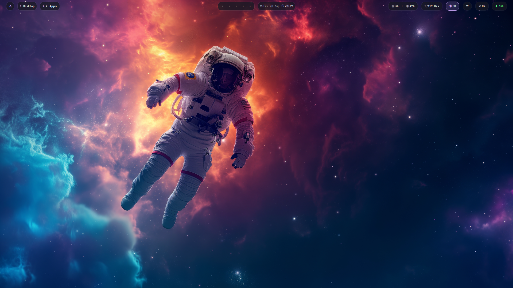
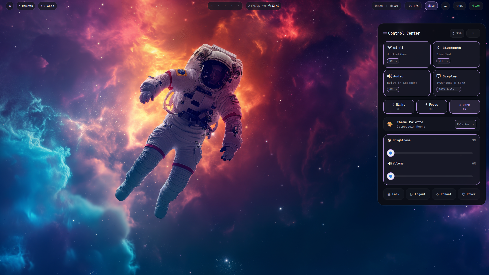
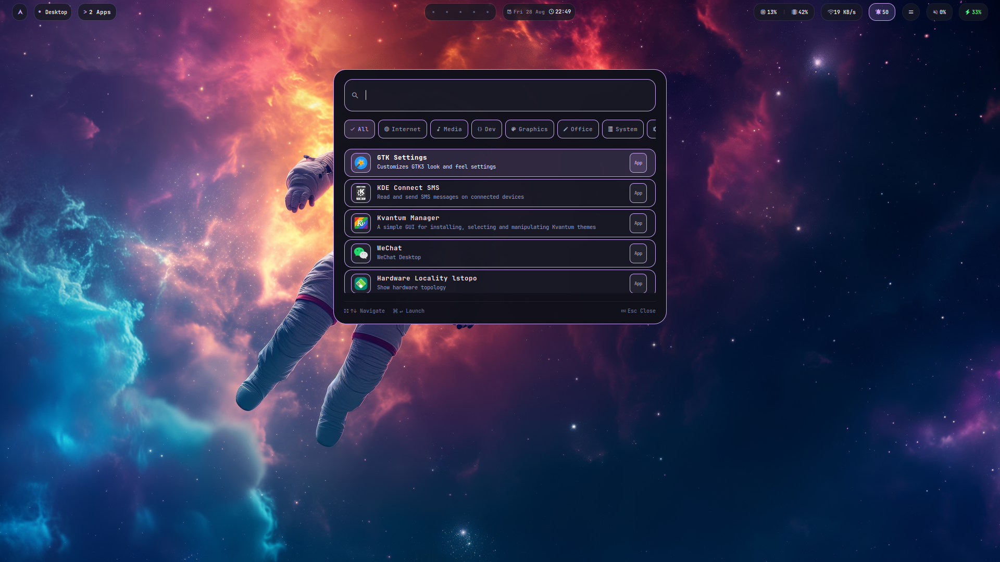
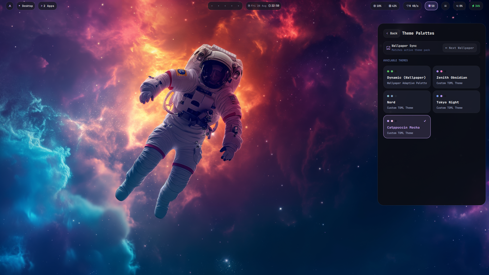
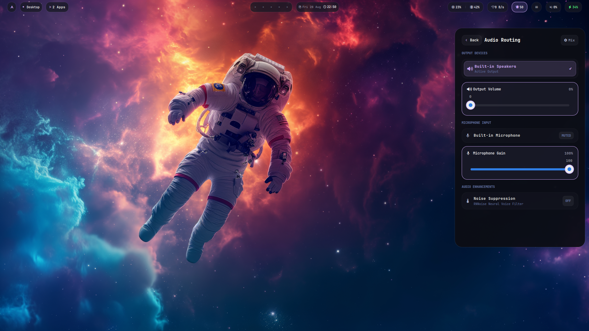
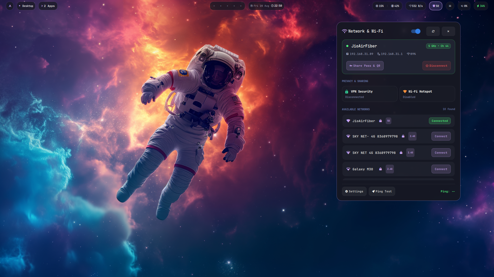
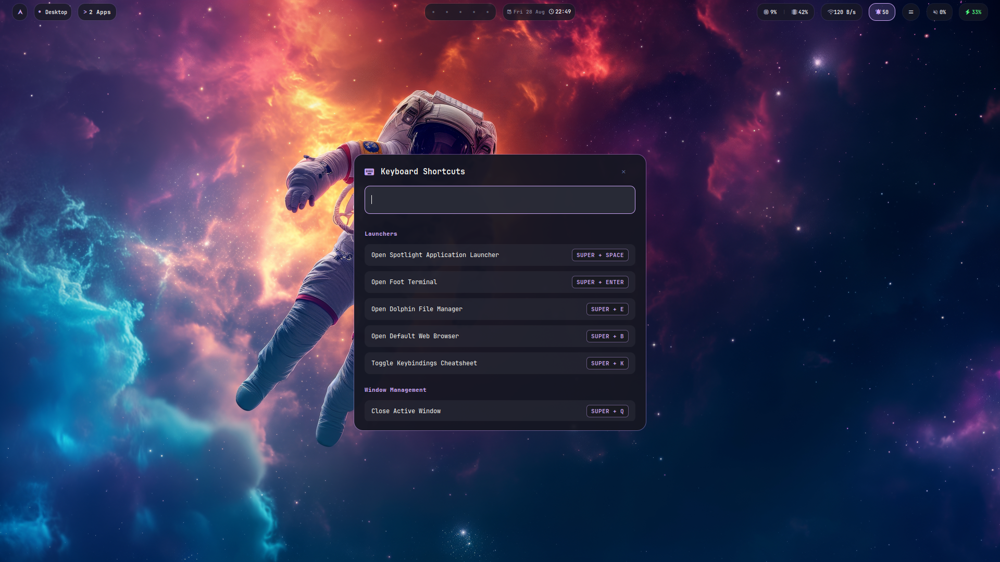
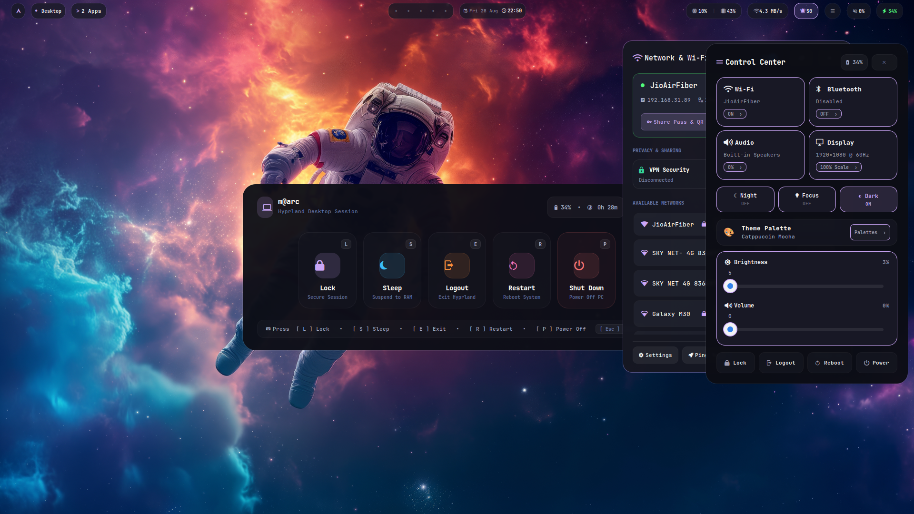

# 🌌 ZenithShell

An ultra-low-footprint, pro-grade desktop shell and widget suite written natively in **C++20** with **GTK3**, **gtk-layer-shell**, **Cairo**, and direct non-polling **Hyprland UNIX Sockets**.

Designed as a high-performance, aesthetically refined replacement for heavy web/QML-based desktop bars, ZenithShell delivers a sub-**30MB RAM** footprint, **0.0% idle CPU** load, and instant sub-40ms startup while providing deep dynamic theming and native Wayland integration.

---

## 📸 UI Showcase & Operations

| **Clean Desktop & Zenith TopBar** | **Flagship Control Center** |
|:---:|:---:|
|  |  |

| **Spotlight Application Launcher** | **23-Theme Palette Drawer** |
|:---:|:---:|
|  |  |

| **Hardware Audio Routing** | **Wi-Fi & Network Manager** |
|:---:|:---:|
|  |  |

| **Interactive Keybinds Cheatsheet** | **Power Menu & Session Controls** |
|:---:|:---:|
|  |  |

---

## 📑 Table of Contents

- [UI Showcase & Operations](#-ui-showcase--operations)
- [Architectural Overview](#-architectural-overview)
- [Directory & File Structure](#-directory--file-structure)
- [Core Features](#-core-features)
- [Design System & Color Philosophy](#-design-system--color-philosophy)
- [Configuration Guide (`config.json`)](#-configuration-guide-configjson)
- [D-Bus IPC & Scripting Interface](#-d-bus-ipc--scripting-interface)
- [Hyprland Keybinding Integration](#-hyprland-keybinding-integration)
- [Build & Installation](#-build--installation)
- [Required Packages Guide (require_package.md)](require_package.md)

---

## 🏛️ Architectural Overview

```text
                                  ZENITHSHELL
                         Native C++20 / GTK3 Desktop Shell
                                        │
     ┌──────────────────┬───────────────┴───────────────┬──────────────────┐
     ▼                  ▼                               ▼                  ▼
  TOPBAR         CONTROL CENTER                  SPOTLIGHT LAUNCHER    THEME ENGINE
- Workspaces      - 2x2 Hero Cards                - Fuzzy App Search    - 23 Presets
- Active Title    - Audio Routing Drill-Down      - Math Evaluator      - Dynamic Pywal
- Clock / Date    - Theme Palettes Drawer         - Category Strip      - 260+ Wallpapers
- SysStats        - 3 Quick Modes (Night/Focus/Dark) - Keyboard Hints   - WCAG AAA Contrast
- Tray & Battery  - Precision Sliders & Power Bar - Shadowless Glass   - Zero Hardcoded Colors
```

---

## 📂 Directory & File Structure

Here is the complete source tree of ZenithShell with the exact purpose of every folder and module:

```text
zenithshell/
├── CMakeLists.txt                 # Modern CMake build definitions and dependency linkage
├── config.json                    # Central user runtime configuration (layout, wallpapers, timers)
├── style.css                      # Master GTK CSS stylesheet with dynamic theme tokens
├── README.md                      # Comprehensive documentation and developer guide
│
├── src/
│   ├── main.cpp                   # Application entry point; initializes App lifecycle
│   ├── gtk3_compat.hpp            # Cross-compatibility shims for GTK3 / GTK4 CSS classes
│   │
│   ├── app/                       # Application Core & Lifecycle
│   │   ├── app.hpp                # App class definition and command-line argument parser
│   │   └── app.cpp                # GTK Application setup, signal binding, and module bootstrapper
│   │
│   ├── compositors/               # Wayland Compositor Integration
│   │   ├── hyprland_ipc.hpp       # Hyprland UNIX socket client header
│   │   └── hyprland_ipc.cpp       # Zero-polling async reader for .socket2.sock (workspace & active window events)
│   │
│   ├── config/                    # JSON Configuration Management
│   │   ├── config.hpp             # Config struct schema and defaults
│   │   └── config.cpp             # nlohmann::json parser loading options from ~/.config/zenithshell/config.json
│   │
│   ├── dbus/                      # Inter-Process Communication & System Daemons
│   │   ├── dbus_service.hpp       # D-Bus IPC service header (dev.zenith.Shell)
│   │   ├── dbus_service.cpp       # D-Bus method dispatcher (Toggle drawers, switch themes, cycle wallpapers)
│   │   ├── mpris_player.hpp       # Media Player Remote Interfacing Specification client header
│   │   ├── mpris_player.cpp       # MPRIS controller (Spotify, Chromium, YouTube media controls)
│   │   ├── notification_manager.hpp # org.freedesktop.Notifications daemon header
│   │   └── notification_manager.cpp # Notification server receiving, queuing, and broadcasting desktop notifications
│   │
│   ├── pipewire/                  # Real-Time Audio Infrastructure
│   │   ├── audio_manager.hpp      # Audio sink/source controller header
│   │   └── audio_manager.cpp      # PipeWire/WirePlumber/wpctl interface for volume and audio routing
│   │
│   ├── system/                    # Hardware Telemetry & Monitoring
│   │   ├── sys_monitor.hpp        # System metrics monitor header
│   │   └── sys_monitor.cpp        # Low-overhead /proc and /sys reader for CPU %, RAM %, Net speed, and Battery %
│   │
│   ├── theme/                     # Dynamic Theme Engine & Mathematical Color Extraction
│   │   ├── theme.hpp              # Theme data structures and token schemas
│   │   ├── theme_engine.hpp       # Central ThemeEngine header
│   │   ├── theme_engine.cpp       # 23 built-in themes, wallpaper scanner (260+ images), and theme applicator
│   │   ├── theme_loader.hpp       # TOML / Packaged theme file loader header
│   │   ├── theme_loader.cpp       # TOML parser for loading external color palette files
│   │   ├── pywal_importer.hpp     # Pywal cache importer header
│   │   ├── pywal_importer.cpp     # Reads Pywal ~/.cache/wal/colors.json and builds dynamic palettes
│   │   ├── color_utils.hpp        # WCAG AAA luminance and contrast calculation utilities
│   │   ├── css_manager.hpp        # CSS provider and live hot-reloader header
│   │   └── css_manager.cpp        # Inotify-based live stylesheet reloader
│   │
│   └── shell/                     # UI Views, Floating Panels & Drawers
│       ├── bar/                   # Primary Desktop TopBar
│       │   ├── bar_window.hpp     # TopBar layer-shell window header
│       │   ├── bar_window.cpp     # TopBar assembly (Workspaces, active window title, sysinfo, clock, tray)
│       │   ├── workspace_widget.hpp # Workspace dots / pill indicators header
│       │   ├── workspace_widget.cpp # Interactive workspace switchers with dynamic theme accents
│       │   ├── clock_widget.hpp   # Dynamic Clock widget header
│       │   ├── clock_widget.cpp   # Formattable date/time display with calendar popup
│       │   ├── sys_info_widget.hpp # Hardware telemetry widget header
│       │   └── sys_info_widget.cpp # Real-time CPU, RAM, Network, and Battery pills
│       │
│       ├── control_center/        # Flagship Control Center Drawer
│       │   ├── control_center.hpp # Control Center header
│       │   ├── control_center.cpp # 2x2 Hero cards, Drill-down GtkStack, Audio Routing, Theme Palettes, Sliders
│       │   ├── wifi_manager.hpp   # NetworkManager Wi-Fi interface header
│       │   └── wifi_manager.cpp   # nmcli Wi-Fi scanner and connection manager
│       │
│       ├── launcher/              # Spotlight Search Application Launcher
│       │   ├── spotlight_search.hpp # Spotlight search header
│       │   ├── spotlight_search.cpp # Fuzzy app search, inline math evaluator, category strip, keyboard navigation
│       │   ├── launcher_widget.hpp  # Classic app launcher grid header
│       │   └── launcher_widget.cpp  # Alternative app menu implementation
│       │
│       ├── notification/          # Notification History Drawer & Toasts
│       │   ├── notification_panel.hpp # Notification history panel header
│       │   └── notification_panel.cpp # Scrolled list of notification history with clear-all actions
│       │
│       ├── clipboard/             # Clipboard History Manager
│       │   ├── clipboard_manager.hpp # Clipboard overlay header
│       │   └── clipboard_manager.cpp # cliphist / wl-clipboard search and paste selector
│       │
│       ├── reminder/              # Task & Reminder Overlay
│       │   ├── reminder_manager.hpp # Reminder overlay header
│       │   └── reminder_manager.cpp # Interactive quick-task checklist
│       │
│       ├── keybinds/              # Keyboard Shortcut Visualizer
│       │   ├── keybinds_overlay.hpp # Keybinds overlay header
│       │   └── keybinds_overlay.cpp # Categorized cheat sheet of system keybindings
│       │
│       ├── power/                 # System Power Menu
│       │   ├── power_menu.hpp     # Power menu header
│       │   └── power_menu.cpp     # Lock, Suspend, Logout, Reboot, and Shutdown actions
│       │
│       ├── task/                  # Active Window Switcher Drawer
│       │   ├── active_apps_drawer.hpp # Active window switcher header
│       │   └── active_apps_drawer.cpp # List of open Hyprland windows for rapid switching
│       │
│       └── tray/                  # System Tray (StatusNotifierItem)
│           ├── system_tray_manager.hpp # System tray manager header
│           └── system_tray_manager.cpp # SNI protocol watcher rendering third-party tray icons
```

---

## ✨ Core Features

### 1. 🚀 Native Wayland & Hyprland Integration
- **Direct UNIX Domain Socket (`.socket2.sock`)**: Listens asynchronously for workspace shifts and window focus without timer polling loops.
- **Layer Shell Overlay**: Configured via `gtk-layer-shell` for true floating cards, customizable anchor points, exclusive screen margins, and click-outside dismissal.

### 2. 🎨 Adaptive Theme Engine
- **23 Built-in Color Palettes**: Includes **Zenith Obsidian**, **Everforest**, **Nord**, **Kanagawa**, **Tokyo Night**, **Catppuccin Mocha**, **Gruvbox**, **Hackerman**, **Matte Black**, **Lumon**, and more.
- **Dynamic Wallpaper Mode (Pywal)**: Automatically extracts dominant wallpaper colors, clamps text luminance to $\ge 0.94$ (WCAG AAA compliant), and bounds accents to a healthy saturation window ($0.50–0.85$).
- **Custom Wallpaper Directory**: Automatically discovers 260+ images from `~/Pictures/wallpapers` or your custom configured path.
- **Zero Hardcoded Purple**: All accent elements bind dynamically to `@zenith_accent`.

### 3. 🔍 Spotlight Search Launcher
- **Instant Search**: Fuzzy desktop application matching from `/usr/share/applications` and `~/.local/share/applications`.
- **Inline Calculator**: Real-time math evaluation with operators, scientific functions (`sqrt`, `sin`, `cos`, `log`, `pow`), and constants (`pi`, `e`).
- **Category Filter Strip**: Fast filtering across Internet, Media, Dev, Graphics, Office, and System.
- **Keyboard Navigation**: Full support for <kbd>↑</kbd> / <kbd>↓</kbd> navigation, <kbd>Enter</kbd> to launch, and <kbd>Esc</kbd> to dismiss.

### 4. 🎛️ Flagship Control Center
- **2x2 Hero Cards**: Quick toggles and drill-downs for Wi-Fi, Bluetooth, Audio Sink Selection, and Display Resolution.
- **3 Quick Modes**: Blue Light Filter (Night), Focus / Do Not Disturb (DND), and System Dark Appearance (Dark).
- **Theme Palette Drawer**: Visual theme switcher grid with live color swatch dots and a **`[ Next Wallpaper ]`** button.
- **Precision Hardware Sliders**: Volume and brightness range controls.

---

## 🎨 Design System & Color Philosophy

ZenithShell strictly implements the **Pro-Grade Design Standard** practiced by top operating systems (macOS, Windows 11, Material You):

```text
       ┌────────────────────────────────────────────────────────────┐
       │             WHAT ADAPTS DYNAMICALLY (THEME ACCENT)         │
       ├────────────────────────────────────────────────────────────┤
       │  ✅  Active workspace pill indicators                      │
       │  ✅  Active toggle buttons (Night ON, Focus ON, Dark ON)   │
       │  ✅  Selected search rows & list items                     │
       │  ✅  Slider track fills & active focus rings               │
       └────────────────────────────────────────────────────────────┘
                                     │
                                     ▼
       ┌────────────────────────────────────────────────────────────┐
       │             WHAT REMAINS ROCK-SOLID & FIXED                │
       ├────────────────────────────────────────────────────────────┤
       │  🔒  Deep Obsidian Surfaces (#0B0C12 / #11121A)            │
       │  🔒  High-Contrast Typography (Luminance ≥ 0.94)           │
       │  🔒  Fixed Semantic States (Success=#3DDC84, Error=#FF5C6C)│
       │  🔒  Calm TopBar & Neutral Inactive Icons (#9A9AAF)        │
       └────────────────────────────────────────────────────────────┘
```

---

## ⚙️ Configuration Guide (`config.json`)

The central configuration file is located at `~/.config/zenithshell/config.json`:

```json
{
    "position": "top",
    "height": 28,
    "margin_top": 4,
    "margin_left": 12,
    "margin_right": 12,
    "exclusive_zone": true,
    "workspaces": {
        "count": 10,
        "show_icons": true
    },
    "clock": {
        "format": "📅 %a %b %d  🕒 %H:%M"
    },
    "sys_info": {
        "update_interval_ms": 1500,
        "show_cpu": true,
        "show_ram": true,
        "show_battery": true
    },
    "wallpaper_dir": "~/Pictures/wallpapers"
}
```

---

## 🔌 D-Bus IPC & Scripting Interface

ZenithShell exposes a rich D-Bus interface on the session bus at `dev.zenith.Shell`:

```bash
# Drawer Toggles
gdbus call --session --dest dev.zenith.Shell --object-path /dev/zenith/Shell --method dev.zenith.Shell.ToggleControlCenter
gdbus call --session --dest dev.zenith.Shell --object-path /dev/zenith/Shell --method dev.zenith.Shell.ToggleSpotlight
gdbus call --session --dest dev.zenith.Shell --object-path /dev/zenith/Shell --method dev.zenith.Shell.ToggleNotifications
gdbus call --session --dest dev.zenith.Shell --object-path /dev/zenith/Shell --method dev.zenith.Shell.ToggleClipboard
gdbus call --session --dest dev.zenith.Shell --object-path /dev/zenith/Shell --method dev.zenith.Shell.ToggleReminders
gdbus call --session --dest dev.zenith.Shell --object-path /dev/zenith/Shell --method dev.zenith.Shell.ToggleKeybinds
gdbus call --session --dest dev.zenith.Shell --object-path /dev/zenith/Shell --method dev.zenith.Shell.ToggleNetwork
gdbus call --session --dest dev.zenith.Shell --object-path /dev/zenith/Shell --method dev.zenith.Shell.TogglePowerMenu
gdbus call --session --dest dev.zenith.Shell --object-path /dev/zenith/Shell --method dev.zenith.Shell.ToggleBar

# Theme & Wallpaper Control
gdbus call --session --dest dev.zenith.Shell --object-path /dev/zenith/Shell --method dev.zenith.Shell.SetTheme "Everforest"
gdbus call --session --dest dev.zenith.Shell --object-path /dev/zenith/Shell --method dev.zenith.Shell.NextTheme
gdbus call --session --dest dev.zenith.Shell --object-path /dev/zenith/Shell --method dev.zenith.Shell.NextWallpaper
gdbus call --session --dest dev.zenith.Shell --object-path /dev/zenith/Shell --method dev.zenith.Shell.SetWallpaper "/path/to/image.jpg"
gdbus call --session --dest dev.zenith.Shell --object-path /dev/zenith/Shell --method dev.zenith.Shell.SetWallpaperDir "~/Pictures/wallpapers"

# Telemetry
gdbus call --session --dest dev.zenith.Shell --object-path /dev/zenith/Shell --method dev.zenith.Shell.GetStats
```

---

## ⌨️ Hyprland Keybinding Integration

Add the following to your `hyprland.conf` or `binds.lua`:

```ini
# ZenithShell Hotkeys
bind = SUPER, SPACE, exec, gdbus call --session --dest dev.zenith.Shell --object-path /dev/zenith/Shell --method dev.zenith.Shell.ToggleSpotlight
bind = SUPER, A,     exec, gdbus call --session --dest dev.zenith.Shell --object-path /dev/zenith/Shell --method dev.zenith.Shell.ToggleControlCenter
bind = SUPER, N,     exec, gdbus call --session --dest dev.zenith.Shell --object-path /dev/zenith/Shell --method dev.zenith.Shell.ToggleNotifications
bind = SUPER, V,     exec, gdbus call --session --dest dev.zenith.Shell --object-path /dev/zenith/Shell --method dev.zenith.Shell.ToggleClipboard
bind = SUPER, R,     exec, gdbus call --session --dest dev.zenith.Shell --object-path /dev/zenith/Shell --method dev.zenith.Shell.ToggleReminders
bind = SUPER, B,     exec, gdbus call --session --dest dev.zenith.Shell --object-path /dev/zenith/Shell --method dev.zenith.Shell.ToggleBar
bind = SUPER, P,     exec, gdbus call --session --dest dev.zenith.Shell --object-path /dev/zenith/Shell --method dev.zenith.Shell.TogglePowerMenu
bind = SUPER CTRL, W, exec, gdbus call --session --dest dev.zenith.Shell --object-path /dev/zenith/Shell --method dev.zenith.Shell.ToggleNetwork
bind = SUPER CTRL, A, exec, gdbus call --session --dest dev.zenith.Shell --object-path /dev/zenith/Shell --method dev.zenith.Shell.ToggleAudio
```

---

## 🚀 Autostart on Boot

To have ZenithShell automatically start when you log in:

### Option A: Standard Hyprland Config
Add this line to your `~/.config/hypr/hyprland.conf`:
```ini
exec-once = zenithshell
```

### Option B: Systemd User Service
ZenithShell includes a systemd unit. Enable and start it:
```bash
systemctl --user enable --now zenithshell
```

---

## 🛠️ Build & Installation

### ⚡ Method 1: Automated One-Line Installer (Recommended)

Simply clone and run the interactive installation script:

```bash
git clone https://github.com/snssuresh877/zenithshell.git ~/Projects/zenithshell
cd ~/Projects/zenithshell
chmod +x install.sh
./install.sh
```

The installer will automatically:
- Detect your Linux distribution (Arch, Fedora, Ubuntu, Debian, Pop!_OS).
- Check and install all necessary dependencies.
- Compile ZenithShell with CMake and Ninja in `Release` mode.
- Install the executable to `~/.local/bin/zenithshell`.
- Deploy `config.json` and `style.css` to `~/.config/zenithshell/`.

---

### 🔧 Method 2: Manual Compilation

```bash
# 1. Configure with CMake & Ninja
cmake -B build -G Ninja -DCMAKE_BUILD_TYPE=Release

# 2. Compile
ninja -C build

# 3. Install Config & Styles
mkdir -p ~/.config/zenithshell
cp config.json ~/.config/zenithshell/config.json
cp style.css ~/.config/zenithshell/style.css

# 4. Install binary
mkdir -p ~/.local/bin
cp build/zenithshell ~/.local/bin/zenithshell
```

---

## 📄 License

ZenithShell is open-source software licensed under the **MIT License**.
